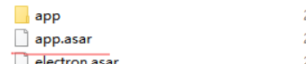

# my-electron-app

## Project setup
```
yarn install
```

### Compiles and hot-reloads for development
```
yarn serve
```
### Compiles and minifies for production
```
yarn build
```

### 

给予Vue3.0脚手架，暂时没有搭建vue2.0  vue-cil没有安装多余插件,响应式兼容处理也没有

#electron 配置

###1.初始化文件夹

在public中执行 npm init 进行npm初始化
``
因为在vue中public文件不会进行编译所以配置好，会在打包的时候直接打包进入dist文件
``
###2.下载依赖
```
npm install --save-dev electron
```
将 electron 包安装到应用的开发依赖中
###3.进行package.json配置
```
{
    "name": "public",
    "version": "1.0.0",
    "description": "",
    "main": "main.js",
    "scripts": {
        "start": "electron .",
        "build": "electron-packager . HelloWorld --win --out ../HelloWorldApp --arch=x64 --version=0.0.1"
    },
    "author": "",
    "license": "ISC",
    "dependencies": {
        "electron": "^15.0.0"
    }
}
```
####配置详情
```
{
    "name": "electron",//项目名称
    "version": "1.0.0",//项目版本号
    "description": "",
    "main": "main.js",//项目入口文件
    "scripts": {
        "start": "electron .", // 调试命令
        "build": "electron-packager . HelloWorld --win --out ../HelloWorldApp --arch=x64 --version=0.0.1"
        //build 为打包命令，依赖于另外的npm包
    },
    "author": "", //作者
    "license": "ISC", //许可证，默认是ISC、有的默认是MIT
    "dependencies": {
        "electron": "^15.0.0"
    }
}
```
###4.创建main.js文件
入口文件,里边代码为Electron的代码
```
const { app, BrowserWindow } = require('electron');//引入electron
let win;
let windowConfig = {
  width: 800,
  height: 600
};//窗口配置程序运行窗口的大小
function createWindow () {
  win = new BrowserWindow(windowConfig);//创建一个窗口
  win.loadURL(`file://${__dirname}/index.html`);
  //在窗口内要展示的内容index.html 就是打包生成的index.html可以设置远程地址
  // win.webContents.openDevTools();  //开启调试工具
  win.on('close', () => {
    //回收BrowserWindow对象
    win = null;
  });
  win.on('resize', () => {
    win.reload();
  })
}
app.on('ready', createWindow);
//监听窗口关闭事件
app.on('window-all-closed', function () {
  app.quit()
})

app.on('activate', () => {
  if (win == null)
  {
    createWindow();
  }
});
```


###5.打包
下载打包依赖
```
npm install -g electron-packager
```

打开命令行我们可以这样使用它：
```
electron-packager . HelloWorld --win --out ../HelloWorldApp --arch=x64 --version=0.0.1
```
格式为
``
electron-packager <应用目录> <应用名称> <打包平台> --out <输出目录> <架构> <应用版本>
``
可以根据格式进行自定义命令,配置在packages.json中,同第二步中的build命令

#提示:除配置文件是在public中配置，命令运行开始所有操作都应在dist文件中进行

###6.打包完成进行加密
打包成功后可以在 resources下app中发现html代码，为了安全考虑，我们需要进行加密处理
全局安装 asar
####提示 全局安装 如电脑中已经安装过，不需要执行npm命令，直接进行加密即可
```
npm install asar -g
```
安装完asar以后,就可以使用asar命令将程序文件打包了。

在resources目录下使用asar指令进行加密``asar pack ./app app.asar``


执行成功后会生成app.asar文件

将原来的app文件夹删除就可以了，这样生成的app.asar就加密了之前的源代码，保证了安全性。

###7.打包成安装包发送给客户
参考下方链接
1. NSIS打包Electron:     http://blog.csdn.net/yu17310133443/article/details/79496499
2. grunt打包Electron:    http://blog.csdn.net/yu17310133443/article/details/79495936

#暂无
